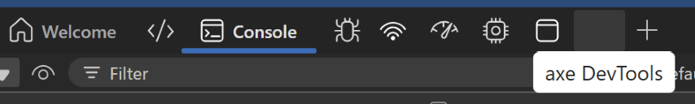
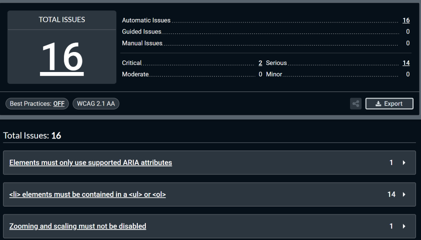

# axe DevTools Guide
@author Jesse Greenberg

Quick reference for using **axe DevTools** to find accessibility issues in a PhET simulation.

axe DevTools is a free browser plugin that automatically scans for common accessibility problems.

## Installation
1. Install [axe DevTools](https://chromewebstore.google.com/detail/axe-devtools-web-accessib/lhdoppojpmngadmnindnejefpokejbdd?hl=en-US) for Chrome or Firefox.  
2. Open **DevTools** in the browser (`F12` or `Cmd+Opt+I` / `Ctrl+Shift+I`).  
3. Select the **axe DevTools** tab.

> ⚠️ There is a bug in the tool where the icon can be invisible. You should be able to find it in the top tabs in your development tools.

## Using axe DevTools
1. Navigate to the simulation in your browser.  
2. Open **axe DevTools** in browser development tools.  
3. Click **"Full Page Scan:"** to scan the current visible content.  
4. Review issues in the results panel.

## Procedure for Testing PhET Simulations
> ⚠️ axe ignores invisible elements. It only reports on what’s visible when you run the scan.

To get good coverage:
- Run a scan on each **screen** in its **default startup state**.  
- Run scans in a few **common states** of the sim.  
- Scan **dialogs/pop-ups** with lots of UI elements.  
- Run a few scans with `?fuzz` to catch state-specific issues.

Most issues are in **common code libraries**.  
- If you can identify the source, open an issue in the correct repo.  
- If not, file in `scenery` and assign to `@jessegreenberg` for triage.

## Acceptable Problems
Some axe issues are expected and **can be ignored** for now:
- “Zooming and scaling must not be disabled”
- Other known global issues (to be listed as we encounter them)

## Example Results
Below is a sample results panel from *Molecules and Light 1.5.28*.

**Critical issues flagged**:
- Elements must only use supported ARIA attributes  
- `<li>` elements must be contained in a `<ul>` or `<ol>`

The **zooming/scaling** warning is acceptable.
