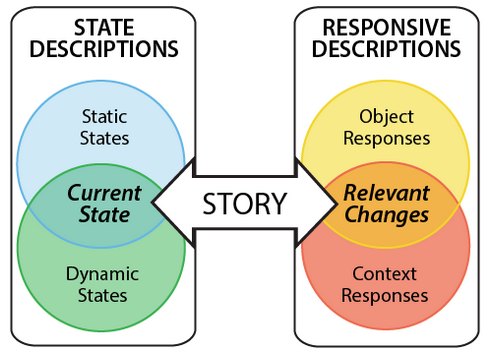

# Core Description Overview (IN PROGRESS)

@author Taliesin Smith
@author Jesse Greenberg

# Description Design Framework

PhET's _Description Design Framework_ divides the design of the Interactive Description feature, the entire interactive story of the sim, into manageable chunks. To meet the goals of _Core Description_, we are designing descriptions of all categories, but we are not designing all descriptions found in the full _Interactive Description_ feature. For _Core Description_ we want to focus on the subset of descriptions pieces that will provide both broad access to learners **AND** meet WCAG Level AA design guidance success criteria.

# What is “Core Description”?
_Core Description_ is a sub set of descriptions needed for the Interactive Description feature that aims to meet WCAG A and AA Success Criteria while at the same time creating a phased description design process that allows the team to open simulation access to learners who rely on description. 

Additionally, design and development of _Core Description_ of several sims at once allows us to improve SceneryStack's high-level APIs, and all the inclusive design and develpment skills of the entire team. Creating a phased description design approach (_Core Description,_ then full _Interactive Description_) allows us to gain the skills and expertise needed when for the second descriptin design phase. 

# What is included and excluded in Core Description
_Core Description_ does not explicitly exclude any categories of description. If it is easy to design and implement, we want to include it. That said, there are clear boundary lines around the design of qualitative parameters needed for more dynamic strings found in Object and Context Responses, and Dynamic State Descriptions.

# Core Description Options (a definition of each and high level overview)
  - screen summary - A _State Description_ that includes static and dynamic descriptions meant to capture a big-picture summary of the current screen. 
  - accessible name - The name (or label) of the interactive object.
  - accessible help text - The supporting descriptions needed to scaffold interaction. Design needs vary by interactive object.
  - accessible headings - The descriptions that provide navigable sections within the PDOM. Headings help create information relationships. 
  - accessible paragraph - A description in the PDOM that is not directly part of an interactive object. Used to contain static or dynamic state descriptions. 
  - accessible object response - a response containing a new value or new state of an interactive object. Not all objects have designed object responses. Slider objects deliver object responses via _aria-valuetext._ Custom objects deliver object responses along side context responses via _ARIA Live._ For _Core Description_ design effort should concentrate on human readable quantitative values relevant to learning. 
  - accessible context response - a response describing surrounding changes to the context as an object is being interacted with. For _Core Description_ design effort should focus on the context responses needed for simple UI components first, and then as respurces allow more complex interactions.

# Drawing the line between Core and Interactive Description
There is no hard and fast line, but if it difficult to design or implement, you can:
- Call in other team memebrs with more experience, and/or discuss at Design Meeting.
- You may need to simplify the information you want to provide.
- Changing qualitative information requiring multiple paraemters with ranges scales are generably not feasible in the _Core Description_ design phase. 
- Descriptions around custom objects
- Keep current details to the absolute essentials. Use binary states if possible, and then provide additional state information close to the interactive object.

# Punctuation
- accessibleName: Title case, no punctuation. Example: “Detector Probe”
- accessibleHelpText: Sentence case, with punctuation. Example: “Move probe or jump to useful positions with keyboard shortcut.”
- accessibleObjectResponse: Fragment, no sentence casing, no punctuation. Example: “1.07 centimeters”
- accessibleContextResponse: Sentence case, with punctuation. Example: "In light source path, centered in cuvette. Transmittance is 52.69 percent."
- accessibleParagraph: a paragraph of full sentences, with sentence case and punctuation. Example: "Transmittance is 52.96 percent."

# Delivery of Descriptions with Screen Reader Software 
- Information users can find and read in the PDOM with their cursor keys without changing the state of the simualtion includes:
    - All information in the screen summary, 
    - Accessible headings, 
    - Accessible names, 
    - Accessible help text, 
    - Descriptions in accessible paragraphs and lists, and
    - The current accessibleObjectResponse for objects like a slider, number picker, number spinner.
  
- Users have many strategeies to read, skim, or scan informtion in the PDOM:
    -  Read continuously from the top, read line-by-line, read by word, or read by letter to reslove ambiguities.
    -  Use screen reader hot keys to navigate document structures such as headings, paragraphs and list items.
 
- When ready to interact, users have many strategies for finding interactive objects:
    - Tab-navigation.
    - Use screen screen reader hot keys to search for common interactions, such as buttons.
    - Use screen screen reader hot keys to find something known to them.
    - Use special navigation modes, e.g. "Forms mode" (JAWS), "Quick Nav" (VoiceOver).
       
- When navigating by interactive object, e.g., Tab-navigation, what users will hear from the scren reader software varies. They expect to hear:
    - an accessble name
    - a current value if the interaction has a value 
    - the role of the interactive object, e.g., button, checkbox, slider
 
- Once making changes, they hear:
   - changing states in "built-in" or accessible object responses  present on the object.
   - changes to surrounding context in accessible context responses.  

# Examples for each Core Description piece
- Do we need this secction? There ar

# References to Descriptoin Design Resources
- [Descriptipn Design Guide: Core](https://docs.google.com/document/d/1kCivjmuXiMzrFkYUigZFgDkssoEWGW_-OaXDk9myV00/edit?tab=t.0#heading=h.rj5etgrq1nf7)
- [Core Description Options](https://github.com/phetsims/phet-info/blob/main/doc/core-description-options.md)
- [PhET's Interactive Style Guide (Binder)](https://phetsims.github.io/binder/)

# References on how to use a screen reader
Tip Sheets from [Description Design for Interactive Learning Resources](https://www.coursera.org/learn/description-design-for-interactive-learning-resources):
- [Using VoiceOver with a PhET Sim](https://docs.google.com/document/d/1qz0Dm2lA67tRhgw1GaHVeOSnldBoMj7AT5UE_UaXz1U/edit?tab=t.0#heading=h.rj5etgrq1nf7)
- [Using NVDA with a PhET Sim] (https://docs.google.com/document/d/1pgfyEER7ZlpJlXSwvSCbNBuoCa5oOexc7QvTuFZu-Mo/edit?tab=t.0#heading=h.rj5etgrq1nf7)
- [Using JAWS with a PhET Sim] (https://docs.google.com/document/d/1aggemqGsb2CdR7PxgLG50kOg4ZwBPM2M3eI3okyZHJ8/edit?tab=t.0#heading=h.rj5etgrq1nf7)

# References to the development overview
- [Core Description Options](https://github.com/phetsims/phet-info/blob/main/doc/core-description-options.md)
- [Core Description Quickstart Guide](https://github.com/phetsims/phet-info/blob/main/doc/core-description-quickstart-guide.md)
- [Core Voicing Quickstart Guide](https://github.com/phetsims/phet-info/blob/main/doc/core-voicing-quickstart-guide.md)
