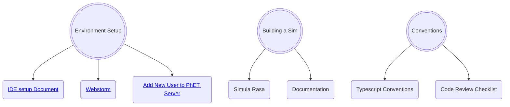

# Onboarding New Software Developers

This document is intended to act as a starting point for new developers that are joining the PhET team and play to
contribute to the development of simulations.  It discusses the process through which a new developer can acquire the
knowledge and skills needed to do this.  Note that there are other software development roles at PhET, such as writing
code for the website, the iOS and Android apps, the desktop app, and the translation utility.  These will not be covered
in this document.

## Intro

Don't panic (with apologies to Douglas Adams).  PhET has been around since 2001, and has written a lot of code and
created some pretty involved processes during that time.  It will take a while for a new developer to learn what they
need to in order to develop and maintain simulations.

Each new developer will have had a unique set of experiences and education when starting at PhET, which means it isn't
possible to come up with a "one-size-fits-all" plan for what to read and work through to ramp up.  Each new developer
will be assigned a mentor who is an experienced developer of PhET simulations, and one of the first steps of the process
should be to come up with a customized plan or "road map" for ramping up.  This should be regularly reviewed and updated
during the process.

## First Steps

In your first few days, there are many configuration and setup steps needed in order to start sim development:  

- [ ] Get a CU Email account and identikey.
- [ ] Set up a Github Account with access to the phetsims organization.
- [ ] Ask Oliver to add you to the SIMS_DEV development team on Github. This will allow you to push code to sim repos.
- [ ] Follow the steps in the [Getting Started](https://github.com/phetsims/phet-info/blob/master/doc/phet-development-overview.md#getting-started)
section of the PhET Development Overview doc to install some command line programs, get a copy of phet repos, and try
out running a sim locally on your machine. TODO from @Luisav1: Improve docs in here about getting all repos.
- [ ] From here, you should set up an IDE so you can start writing code. Most developers use Webstorm or IntelliJ IDEA. 
Instructions for both of those can be found in the [IDE setup document](https://github.com/phetsims/phet-info/blob/master/ide/idea/setup.md).
- [ ] Before you start committing and pushing code to PhET repos, you should set up pre-commit hooks. These prevent
developers from committing code that has various types of errors, most notably ESLint and TypeScript errors. Follow
step 13. of [Utilities and Instrumentation for Development and Testing](https://github.com/phetsims/phet-info/blob/master/doc/phet-development-overview.md#utilities-and-instrumentation-for-development-and-testing)
in the PhET Development Overview doc for instructions on setting them up.

## Background Reading

There are a number of documents that can help with understanding the conventions and patterns used by PhET when
developing simulations.  Here is a list, in rough priority order, with notes about how to approach each doc.

TODO: Break this up more in to smaller pieces and add anything that's missing. @Luisav1 and @chrisklus would like to
pick out more specific documentation to read for this section and also more helpful tools that weren't mentioned above,
like running `grunt lint`.
- [ ] [PhET Software Design Patterns](./phet-software-design-patterns.md)
  - This document has a bunch of different patterns in alphabetical order.  They are not all equally important.  Below
  is a list of the patterns in the order in which they should be read.  At the top of the list are patterns that are
  central to the development process and necessary for pretty much every sim.  Below that are patterns that may be
  useful at some point, but aren't in every sim, so they can be skimmed and referenced when needed.
  - *Patterns that every PhET developer should know well, read in this order:*
    - Module
    - Namespace
    - Model-View-Controller (MVC)
    - Model-View Transform
    - Observer
    - Options (TypeScript)
    - Dispose
    - Enumeration
  - *Patterns to be aware of and reference when needed:*
    - Mixin and Trait
    - Singleton
    - Dependency Injection
    - Creator
    - Scenes
    - Strategy
    - State Machine
    - Options and Config (JavaScript)

## Reference Documents

Below is a list of documents that are helpful for reference.  It's important to know that these exist.  New developers
should skim through them, and then reference them as needed when developing code.

- [ ] [Typescript Conventions](./typescript-conventions.md) that PhET has decided on.
- [ ] [The Code Review Checklist](../checklists/code_review_checklist.md) (CRC).
- [ ] Once you're working on a sim, you will eventually want to publish a dev version to show your latest progress. See
  [Adding new users to PhET's servers](https://github.com/phetsims/website#adding-new-users-to-phets-servers-so-a-user-can-upload-a-dev-version-or-participate-in-web-development)
  and ask a senior dev to help add your identikey to PhET's servers.

## Early stages of development

Once your machine is configured to start sim development from the steps above, you can start learning about the patterns
that PhET uses when writing code, and do some additional steps to continue ramping up your PhET development abilities.

