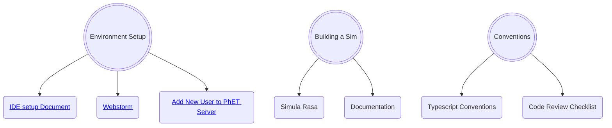

# Onboarding New Software Developers

## Intro

This document is a place for new developers to go to see (hopefully) everything that they need to get ramped up with 
their environment at PhET.

## Steps

Each new developer will be assigned a mentor who is an experienced developer of PhET simulations.  The new developer
should work with their mentor to set up a "ramp-up plan".  Part of that plan will involve reading some introductory
documentation.  The list below can serve as a rough guide, but the details - and the depth to which each of these
documents should be studies - will need to be customized for the particular needs of the new developer.

- [ ] The vast majority of info can be found in [PhET Development Overview](https://github.com/phetsims/phet-info/blob/master/doc/phet-development-overview.md)
- [ ] Set up a Github Account with access to the phetsims organization.
- [ ] Have a CU Email account
- [ ] Familiarize yourself with many documents that outline how PhET developers operate. The majority of documents in
  [phet-info/doc](https://github.com/phetsims/phet-info/tree/master/doc) will be helpful here:
  - [ ] [IDE setup document](https://github.com/phetsims/phet-info/blob/master/ide/idea/setup.md)
  - [ ] [PhET Software Design Patterns](./phet-software-design-patterns.md)
  - [ ] [Typescript Quick Start](./typescript-quick-start.md) and how PhET uses it.
  - [ ] [Typescript Conventions](./typescript-conventions.md) that PhET has decided on.
  - [ ] [The Code Review Checklist](../checklists/code_review_checklist.md) (CRC).
- [ ] [Adding new users to PhET's servers](https://github.com/phetsims/website#adding-new-users-to-phets-servers-so-a-user-can-upload-a-dev-version-or-participate-in-web-development)

