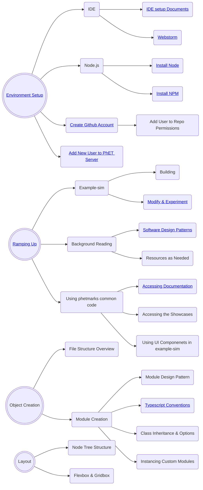

# Onboarding New Software Developers

This document is intended as a starting point for new developers that are joining the PhET team and play to contribute
to the development of simulations.  It discusses the process through which a new developer can acquire the knowledge and
skills needed to do this.  Note that there are other software development roles at PhET, such as writing code for the
website, the iOS and Android apps, the desktop app, and the translation utility.  These will not be covered in this
document.

## Table of Contents
- [Intro](#intro)
- [Administrative Setup](#admin-setup)
- [Dev Environment Setup](#env-setup)
- [Ramping Up](#ramping-up)
- [Helpful Documents](#helpful-docs)
- [Glossary of Documentation](#glossary)
- [Sample Roadmap](#roadmap)

<a id="intro">

## :wave: Intro 

Don't panic (with apologies to Douglas Adams).  PhET has been around since 2001, and has written a lot of code and
created some pretty involved processes during that time.  It will take a while for a new developer to learn what they
need to in order to develop and maintain simulations.

Each new developer will have had a unique set of experiences and education when starting at PhET, which means it isn't
possible to come up with a "one-size-fits-all" plan for what to read and work through to ramp up.  Each new developer
will be assigned a mentor who is an experienced developer of PhET simulations, and one of the first steps of the process
should be to come up with a customized plan or "road map" for ramping up.  This should be regularly reviewed and updated
during the process.

<a id='admin-setup'>
 
## :memo: Administrative Setup
 
In your first few days there are many configuration and setups steps that need to be completed in order to become a CU and PhET employee. Check-in with the PhET Business Manager for a complete list of HR needs. The list below is not comprehensive and is specific towards a PhET Developer's needs.
 
- Get a CU Email account and identikey.
- Set up a Github Account with access to the phetsims organization (you should receive an invite to join).
- Ask the Business Manager to add you to the SIMS_DEV and BROWSER_SIDE_COMMON_CODE development teams on Github. This will allow you to push code to sim repos and common code repos.
- Set up a Slack account and join the phetsims workspace (you should receive an invite to join). From here, join the #general, #dev-public, #developer, and #continuous-testing channel.
   - Be sure to set notifications in #continuous-testing to "All messages". Also, check with your mentor about any
other relevant channels to join.
   - If you're not familiar with Slack, check out some [tutorials](https://slack.com/help/categories/360000049063) on how to use it.
 
 <a id='env-setup'>
 
## :technologist: Dev Environment Setup

Itching to dig into the code? The following are the steps needed in order to start sim development:  

- Follow the steps in the [Getting Started](https://github.com/phetsims/phet-info/blob/master/doc/phet-development-overview.md#getting-started)
section of the PhET Development Overview doc.
  - Install some command line programs
  - Get a copy of phet repos
  - Try out running a sim locally on your machine.
- Set up an IDE so you can start writing code. 
  - Most developers use Webstorm or IntelliJ IDEA, recommended instructions can be found in the [IDE setup document](https://github.com/phetsims/phet-info/blob/master/ide/idea/setup.md).
- Before you start committing and pushing code to PhET repos, you should set up pre-commit hooks.
  - Pre-Commit Hooks prevent developers from committing code that has various types of errors, most notably ESLint and TypeScript errors.
  - Follow step 13. of [Utilities and Instrumentation for Development and Testing](https://github.com/phetsims/phet-info/blob/master/doc/phet-development-overview.md#utilities-and-instrumentation-for-development-and-testing) in the PhET Development Overview doc for instructions on setting them up.

 <a id='ramping-up'>
 
## :climbing: Ramping Up
  
### Pre-Commit Hooks
  During environment setup, you installed git hooks to prevent committing lint, tsc, and unit-test errors. However, it 
can be frustrating and error-prone to discover these errors for the first time when trying to commit. Therefore it is 
advantageous to run these intermittently during development. Specifically, there is a script `chipper/js/scripts/precommit-hook-multi.js`
which will run the precommit hooks on any repos with working copy changes. Results are cached so the precommit hooks themselves
will run quickly. It is recommended to set `chipper/js/scripts/precommit-hook-multi.js` as an External Tool in WebStorm/
IntelliJ and bind it to a key command for ease-of-use.
  
### Phetmarks
  Developers use phetmarks to run simulations and access other content. You can load it in the browser via your
localhost server at `{{path-to-phet-repos}}/phetmarks`.
  
  phetmarks contains different ways to run sims, demos for some non-sim repos to show what components they contain, and links to documentation.
  
### Query Parameters
  
  Sims can be run with various query parameters. Query parameters are by default "for internal use only" and should
not be shared outside of PhET. Public-facing query parameters must be explicitly designated by including `public: true`
in their schema. 

  Chipper's [initialize-globals.js](https://github.com/phetsims/chipper/blob/master/js/initialize-globals.js) constains general global query parameters (preloaded). Two examples of commonly used query params are:
  - `fuzz`, used for testing a sim with random inputs
  - `dev`, used for showing the dev bounds of a sim, are two examples from initialize-globals.js that are commonly used.
  
### Publishing a Sim
  Once you're working on a sim, you will eventually want to publish a dev version to show your latest progress. See
  [Adding new users to PhET's servers](https://github.com/phetsims/website#adding-new-users-to-phets-servers-so-a-user-can-upload-a-dev-version-or-participate-in-web-development) and ask a senior dev to help add your identikey to PhET's servers.

### Navigating Repos
  Most of your work will be done in the `js` directory of a repo. If you are curious about the other files check out the
  [Repository Structure](https://github.com/phetsims/phet-info/blob/master/checklists/code_review_checklist.md#repository-structure)
  in the Code Review Checklist for an overview or ask your mentor for an explanation.

 <a id='helpful-docs'>
  
## :book: Helpful Documents

Below is a list of documents that are helpful for reference.  It's important to know that these exist.  New developers
should skim through them, and then reference them as needed while developing code.
  
- [PhET Software Design Patterns](./phet-software-design-patterns.md) provides an introduction to new developers on how to use PhET specific design patterns. We advise to read through "Observer" and then try out the following introductory excercises.
  - [Intro Excercises for Developers](https://github.com/phetsims/phet-info/blob/master/doc/phet-dev-excercises.md)

- [Typescript Conventions](./typescript-conventions.md) that PhET has decided on.
- [The Code Review Checklist](../checklists/code_review_checklist.md) (CRC).
- If you are working on a game you may need: [Private Features for PhET Team Members](https://github.com/phetsims/special-ops/blob/master/doc/phetTeamMember.md)
  
  <a id='glossary'>
  
## :classical_building: Glossary of Documentation
| Doc | Contents |
| ---- | ------ |
| New Dev Onboarding | A guide and resource for new sim developers |
| Responsible Devs | Associates repos with the dev responsible for maintenance |

<a id='roadmap'>
    
## 		:car: Sample Roadmap 

Once your [machine is configured](#env-setup) to start sim development, you can start learning about the patterns
that PhET uses when writing code. The flowchart below provides just one example of how you may choose to structure your learning and growth here at PhET. We recommend checking in with your mentor to customize your roadmap according to your needs and experiences.

  TODO: Currently Example Sim node is linking to Example-Sim repo. May want to link to tutorial instead.

