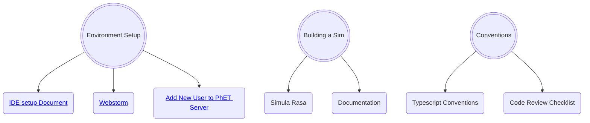

# Onboarding New Software Developers

## Intro

This document is a place for new developers to go to see (hopefully) everything that they need to get ramped up with 
their environment at PhET.

Each new developer will be assigned a mentor who is an experienced developer of PhET simulations. The new developer
should work with their mentor to set up a "ramp-up plan". Part of that plan will involve reading some introductory
documentation. The steps below can serve as a rough guide, but the details - and the depth to which each of these
documents should be studied - will need to be customized for the particular needs of the new developer.

## First Steps

In your first few days, there are many configuration and setup steps needed in order to start sim development:  

- [ ] Get a CU Email account and identikey.
- [ ] Set up a Github Account with access to the phetsims organization.
  - [ ] Ask Oliver to add you to the SIMS_DEV development team on Github. This will allow you to push code to sim repos.
- [ ] Follow the steps in the [Getting Started](https://github.com/phetsims/phet-info/blob/master/doc/phet-development-overview.md#getting-started)
section of the PhET Development Overview doc to install some command line programs, get a copy of phet repos, and try
out running a sim locally on your machine. TODO from @Luisav1: Improve docs in here about getting all repos.
- From here, you should set up an IDE so you can start writing code. Most developers use Webstorm or IntelliJ IDEA. 
Instructions for both of those can be found in the [IDE setup document](https://github.com/phetsims/phet-info/blob/master/ide/idea/setup.md).
- [ ] Before you start committing and pushing code to PhET repos, you should set up pre-commit hooks. These prevent
developers from committing code that has various types of errors, most notably ESLint and TypeScript errors. Follow
step 13. of [Utilities and Instrumentation for Development and Testing](https://github.com/phetsims/phet-info/blob/master/doc/phet-development-overview.md#utilities-and-instrumentation-for-development-and-testing)
in the PhET Development Overview doc for instructions on setting them up.

## Early stages of development

Once your machine is configured to start sim development from the steps above, you can start learning about the patterns
that PhET uses when writing code, and do some additional steps to continue ramping up your PhET development abilities.

TODO: Break this up more in to smaller pieces and add anything that's missing. @Luisav1 and @chrisklus would like to
pick out more specific documentation to read for this section and also more helpful tools that weren't mentioned above,
like running `grunt lint`. 
- [ ] [PhET Software Design Patterns](./phet-software-design-patterns.md)
- [ ] [Typescript Conventions](./typescript-conventions.md) that PhET has decided on.
- [ ] [The Code Review Checklist](../checklists/code_review_checklist.md) (CRC).
- [ ] Once you're working on a sim, you will eventually want to publish a dev version to show your latest progress. See
[Adding new users to PhET's servers](https://github.com/phetsims/website#adding-new-users-to-phets-servers-so-a-user-can-upload-a-dev-version-or-participate-in-web-development)
and ask a senior dev to help add your identikey to PhET's servers. 

