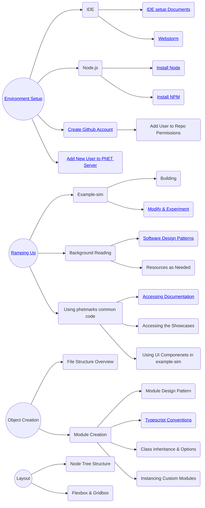

# Onboarding New Software Developers

This document is intended as a starting point for new developers that are joining the PhET team and plan to contribute
to the development of simulations. The document discusses the process through which a new developer can acquire the
knowledge and skills needed to do create and maintain PhET simulations.

Note that there are other software development roles at PhET, such as writing code for the website, the iOS and Android
apps, the desktop app, and the translation utility. These will not be covered in this document.

## Table of Contents

- [Intro](#intro)
- [Administrative Setup](#admin-setup)
- [Dev Environment Setup](#env-setup)
- [Ramping Up](#ramping-up)
- [Sample Roadmap](#roadmap)
- [Reference Documents](#reference-docs)

<a id="intro">

## 👋 Intro

Don't panic (with apologies to Douglas Adams). PhET has been around since 2001, and has written a lot of code and
created some pretty involved processes during that time. It will take a while for a new developer to learn what they
need to know to develop and maintain simulations.

Each new developer will have had a unique set of experiences and education when starting at PhET, so it isn't really
possible to come up with a "one-size-fits-all" plan for what to read and work through to ramp up. Each new developer
will be assigned a mentor who is an experienced developer of PhET simulations, and one of the first steps of the process
should be to come up with a customized plan or "road map" for ramping up. This should be regularly reviewed and updated
during the process.

<a id='admin-setup'>

## 📝 Administrative Setup

In your first few days there are many configuration and setups steps that need to be completed in order to become a CU
and PhET employee. Check-in with the PhET Business Manager for a complete list of HR needs. The list below is not
comprehensive and is specific towards a PhET Developer's needs.

- Get a CU Email account and identikey.
- Set up a Github Account with access to the phetsims organization (you should receive an invite to join).
- Ask the Business Manager to add you to the SIMS_DEV and BROWSER_SIDE_COMMON_CODE development teams on Github. This
  will allow you to push code to sim repos and common code repos.
- Set up a Slack account and join the phetsims workspace (you should receive an invite to join). From here, join the
  #general, #dev-public, #developer, and #continuous-testing channel.
    - Be sure to set notifications in #continuous-testing to "All messages". Also, check with your mentor about any
      other relevant channels to join.
    - If you're not familiar with Slack, check out some [tutorials](https://slack.com/help/categories/360000049063) on
      how to use it.

 <a id='env-setup'>

## 👩‍💻 Development Environment Setup

Itching to dig into the code? The following are the steps needed in order to start sim development:

- Follow the steps in
  the [Getting Started](https://github.com/phetsims/phet-info/blob/master/doc/phet-development-overview.md#getting-started)
  section of the PhET Development Overview doc.
    - Install some command line programs
    - Get a copy of phet repos
    - Try out running a sim locally on your machine.
- Set up an IDE so you can start writing code.
    - Most developers use Webstorm or IntelliJ IDEA, recommended instructions can be found in
      the [IDE setup document](https://github.com/phetsims/phet-info/blob/master/ide/idea/setup.md).
- Before you start committing and pushing code to PhET repos, you should set up pre-commit hooks.
    - Pre-Commit Hooks prevent developers from committing code that has various types of errors, most notably ESLint and
      TypeScript errors.
    - Follow step 13.
      of [Utilities and Instrumentation for Development and Testing](https://github.com/phetsims/phet-info/blob/master/doc/phet-development-overview.md#utilities-and-instrumentation-for-development-and-testing)
      in the PhET Development Overview doc for instructions on setting them up.
 
 <a id='ramping-up'>

## 🧗 Ramping Up

### Pre-Commit Hooks

During environment setup, you installed git hooks to prevent committing lint, tsc, and unit-test errors. However, it can
be frustrating and error-prone to discover these errors for the first time when trying to commit. Therefore it is
advantageous to run these intermittently during development. Specifically, there is a
script `chipper/js/scripts/precommit-hook-multi.js`
which will run the precommit hooks on any repos with working copy changes. Results are cached so the precommit hooks
themselves will run quickly. It is recommended to set `chipper/js/scripts/precommit-hook-multi.js` as an External Tool
in WebStorm/ IntelliJ and bind it to a key command for ease-of-use.

### Phetmarks

Developers use phetmarks to run simulations and access other content. You can load it in the browser via your localhost
server at `{{path-to-phet-repos}}/phetmarks`.

phetmarks contains different ways to run sims, demos for some non-sim repos to show what components they contain, and
links to documentation.
   
A very powerful tool to get familiar with PhET elements is to load one common repo (Sun, for example), press `Ctrl+Shift+H` and click on the component you want to know more about. It'll display information about it, and you can then look up its internal code to read how it was used.

### Query Parameters

Sims can be run with various query parameters. Query parameters are by default "for internal use only" and should not be
shared outside of PhET. Public-facing query parameters must be explicitly designated by including `public: true`
in their schema.

Chipper's [initialize-globals.js](https://github.com/phetsims/chipper/blob/master/js/initialize-globals.js) constains
general global query parameters (preloaded). Two examples of commonly used query params are:

- `fuzz`, used for testing a sim with random inputs
- `dev`, used for showing the dev bounds of a sim, are two examples from initialize-globals.js that are commonly used.

### Automated Testing

PhET has a "Continuous Test" server that regularly pulls the latest code for all repositories, builds them, and
executes "fuzz testing" (random mouse and touch inputs), and reports whether each of these sub-tests succeeded. The
latest report can be found at
https://bayes.colorado.edu/continuous-testing/aqua/html/continuous-report.html.

The repository in which the code that implements the test server is called [aqua](https://github.com/phetsims/aqua).
This code can also be run locally, which is useful when trying to verify common code changes.

PhET has a Slack channel called "continuous-test" which is used by the server to notify developers when some major
status change occurs for the continuous testing process.  For example, if a lint error ends up in the code base, the
server will send a message on this Slack channel.
   
- #### QUnit
   
Unit testing at PhET is done through [QUnit](https://qunitjs.com/). Although most sims do not have unit testing built in, developers are encouraged to use unit testing as feels necessary for your development workflow. Most unit tests exist in common-code repos and these tests are run as part of pre-commit hooks and continuous testing.
   
To run QUnit tests navigate to the repo in question in PhETmarks and click on Unit Tests (Unbuilt). Running the tests in the browser provides better error reporting, and debugging tools.
   
### Typescript

#### History

PhET made a decision in early 2022 to migrate from JavaScript to TypeScript as the primary development language for our
simulations and build tools.  This was motivated by a desire to have stronger type checking so that our code base would
be easier to navigate and maintain.

Much of the common code was migrated to TypeScript when this decision was made, but we did not proactively migrate the
simulations due to the cost of doing so.  Many of these remain in JavaScript, and are likely to stay that way for a long
while if not indefinitely. New developers should be prepared to encounter a mix of TypeScript and JavaScript in the
codebase, and may even be asked to fix or extend simulations that are written in JavaScript.

Also, the standards for TypeScript evolved quite a bit while the migration was in progress.  It is therefore possible
that developers could encounter code that is written in TypeScript, but doesn't fully adhere to the current standards.
For this reason, always double check that any code that is being leveraged for a new sim meets the current standards.
Also, be prepared to fix up code that *doesn't* meet those standards.  For a bit more information on the history of
this, and on some specific things that changed during PhET's TypeScript evolution, please see
https://github.com/phetsims/chipper/issues/1281.

#### TSC

When you begin working in Typescript files you might hear a lot about tsc (Typescript Compiler):
- tsc runs a type checker that will output type errors in our code. This type checking is already included in pre-commit hooks, but many developers enjoy having a tool where they can check for type errors outside of pre-commit hooks.
- The recommended method for running tsc is through our script [absolute-tsc.js](https://github.com/phetsims/chipper/blob/master/js/scripts/absolute-tsc.js). Documentation for how to run absolute-tsc from the command line, or as an external tool in Webstorm can be found at the top of the file.
- The [Typescript Handbook](https://www.typescriptlang.org/docs/handbook/intro.html) is a great resource for diving into Typescript. You can also find PhET specific Typescript Conventions in the [Reference Documents](#reference-docs) section.

### Publishing a Sim

Once you're working on a sim, you will eventually want to publish a dev version to show your latest progress. See
[Adding new users to PhET's servers](https://github.com/phetsims/website#adding-new-users-to-phets-servers-so-a-user-can-upload-a-dev-version-or-participate-in-web-development)
and ask a senior dev to help add your identikey to PhET's servers.

### Navigating Repos

Most of your work will be done in the `js` directory of a repo. If you are curious about the other files check out the
[Repository Structure](https://github.com/phetsims/phet-info/blob/master/checklists/code_review_checklist.md#repository-structure)
in the Code Review Checklist for an overview or ask your mentor for an explanation. |

<a id='roadmap'>

## 🚗 Sample Roadmap

Once your [machine is configured](#env-setup) to start sim development, you can start learning about the patterns that
PhET uses when writing code. The flowchart below provides just one example of how you may choose to structure your
learning and growth here at PhET. We recommend checking in with your mentor to customize your roadmap according to your
needs and experiences.

TODO: Currently Example Sim node is linking to Example-Sim repo. May want to link to tutorial instead.

 <a id='reference-docs'>

## 📖 Reference Documents

Below is a list of documents that are helpful for reference. It's important to know that these exist. New developers
should skim through them, and then reference them as needed while developing code.

| Doc                                                                                                                 | Contents                                                                          |
|---------------------------------------------------------------------------------------------------------------------|-----------------------------------------------------------------------------------|
| [New Dev Onboarding](./new-dev-onboarding.md)                                                                       | A guide and resource for new sim developers (this document)                       |
| [PhET Code Review Checklist](../checklists/code_review_checklist.md)                                                | A checklist for evaluating simulation code                                        |
| [PhET Development Overview](./phet-development-overview.md)                                                         | A checklist for evaluating simulation code                                        |
| [PhET Software Design Patterns](./phet-software-design-patterns.md)                                                 | Provides information on how PhET uses various software design patterns            |
| [Private Features for PhET Team Members](https://github.com/phetsims/special-ops/blob/master/doc/phetTeamMember.md) | Information on hidden features. This comes up most often during game development. |
| [Responsible Devs](../sim-info/responsible_dev.md)                                                                  | Associates repos with the developer who is responsible for maintenance            |
| [Typescript Conventions](./typescript-conventions.md)                                                               | PhET's TypeScript conventions                                                     |