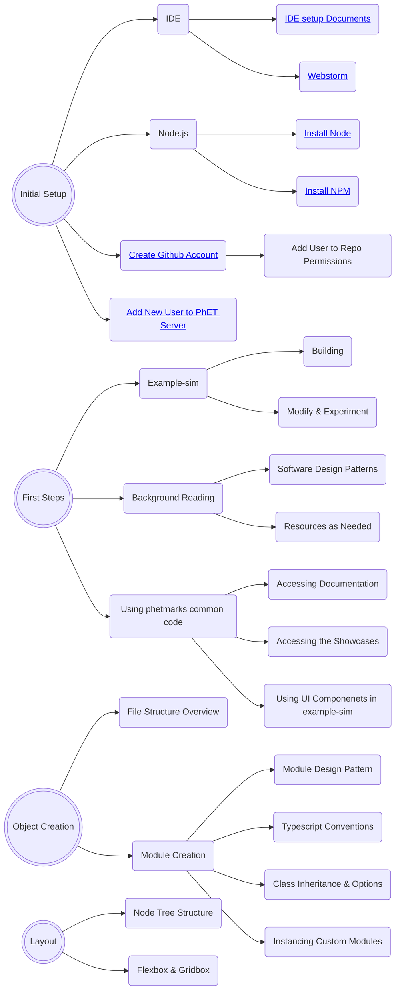

# Onboarding New Software Developers

This document is intended to act as a starting point for new developers that are joining the PhET team and play to
contribute to the development of simulations.  It discusses the process through which a new developer can acquire the
knowledge and skills needed to do this.  Note that there are other software development roles at PhET, such as writing
code for the website, the iOS and Android apps, the desktop app, and the translation utility.  These will not be covered
in this document.

## :wave: Intro

Don't panic (with apologies to Douglas Adams).  PhET has been around since 2001, and has written a lot of code and
created some pretty involved processes during that time.  It will take a while for a new developer to learn what they
need to in order to develop and maintain simulations.

Each new developer will have had a unique set of experiences and education when starting at PhET, which means it isn't
possible to come up with a "one-size-fits-all" plan for what to read and work through to ramp up.  Each new developer
will be assigned a mentor who is an experienced developer of PhET simulations, and one of the first steps of the process
should be to come up with a customized plan or "road map" for ramping up.  This should be regularly reviewed and updated
during the process.

## :technologist: First Steps

In your first few days, there are many configuration and setup steps needed in order to start sim development:  

- [ ] Get a CU Email account and identikey.
- [ ] Set up a Github Account with access to the phetsims organization.
- [ ] Ask Oliver to add you to the SIMS_DEV development team on Github. This will allow you to push code to sim repos.
- [ ] Set up a Slack account and join the phetsims workspace. From here, join the #general, #dev-public, #developer, and
\#continuous-testing channel. Be sure to set notifications in #continuous-testing to "All messages". Also, check with your mentor about any
other relevant channels to join. If you're not familiar with Slack, check out some [tutorials](https://slack.com/help/categories/360000049063) on how to use it.
- [ ] Follow the steps in the [Getting Started](https://github.com/phetsims/phet-info/blob/master/doc/phet-development-overview.md#getting-started)
section of the PhET Development Overview doc to install some command line programs, get a copy of phet repos, and try
out running a sim locally on your machine.
- [ ] From here, you should set up an IDE so you can start writing code. Most developers use Webstorm or IntelliJ IDEA. 
Instructions for both of those can be found in the [IDE setup document](https://github.com/phetsims/phet-info/blob/master/ide/idea/setup.md).
- [ ] Before you start committing and pushing code to PhET repos, you should set up pre-commit hooks. These prevent
developers from committing code that has various types of errors, most notably ESLint and TypeScript errors. Follow
step 13. of [Utilities and Instrumentation for Development and Testing](https://github.com/phetsims/phet-info/blob/master/doc/phet-development-overview.md#utilities-and-instrumentation-for-development-and-testing)
in the PhET Development Overview doc for instructions on setting them up.

## :climbing: Next steps

- [ ] In the above steps, you installed git hooks to prevent committing lint and tsc errors. However, it can be 
more time-consuming to first discover these errors when trying to commit. Some developers like to make sure the commit 
is going to succeed by manually checking that lint and tsc are passing first. You can use the git hooks independently
from WebStorm by running `node {{path-to-phet-repos}}/perennial/js/scripts/hook-pre-commit.js --console`. You also
check lint and tsc separately by running `grunt lint` or `tsc` in a sim repo.
- [ ] Developers use phetmarks to run simulations and access other content. You can load it in the browser via your
localhost server at `{{path-to-phet-repos}}/phetmarks`. phetmarks contains different ways to run sims, demos for some
non-sim repos to show what components they contain, and links to documentation.
- [ ] Sims can be run with various query parameters. Query parameters are by default "for internal use only" and should
not be shared outside of PhET. Public-facing query parameters must be explicitly designated by including `public: true`
in their schema. The following places contain relevant query parameters to know about:
  * chipper initialize-globals.js for general global query parameters (preloaded)
    * `fuzz`, used for testing a sim with random inputs, and `dev`, used for showing the dev bounds of a sim, are two examples from initialize-globals.js that are commonly used.
  * phet-io phet-io-initialize-globals.js for PhET-iO global query parameters (preloaded)
  * {{REPO}}QueryParameters.js or {{REPO}}QueryParameters.ts for sim-specific query parameters
- [ ] Once you're working on a sim, you will eventually want to publish a dev version to show your latest progress. See
  [Adding new users to PhET's servers](https://github.com/phetsims/website#adding-new-users-to-phets-servers-so-a-user-can-upload-a-dev-version-or-participate-in-web-development)
  and ask a senior dev to help add your identikey to PhET's servers.

## :book: Reference Documents

Below is a list of documents that are helpful for reference.  It's important to know that these exist.  New developers
should skim through them, and then reference them as needed when developing code.

* [Typescript Conventions](./typescript-conventions.md) that PhET has decided on.
* [The Code Review Checklist](../checklists/code_review_checklist.md) (CRC).
* [PhET Software Design Patterns](./phet-software-design-patterns.md): This document has an introduction that describes to new developers how to use PhET specific design patterns. We advise to read through 'Observer' and then try out the following introductory excercises.
  - [ ] Tutorial 1 # TODO
  - [ ] Tutorial 2

## :teacher: Early stages of development 

Once your machine is configured to start sim development from the steps above, you can start learning about the patterns
that PhET uses when writing code, and do some additional steps to continue ramping up your PhET development abilities.

## :classical_building: Glossary of Documentation
| Doc | Contents |
| ---- | ------ |
| New Dev Onboarding | A guide and resource for new sim developers |
| Responsible Devs | Associates repos with the dev responsible for maintenance |
