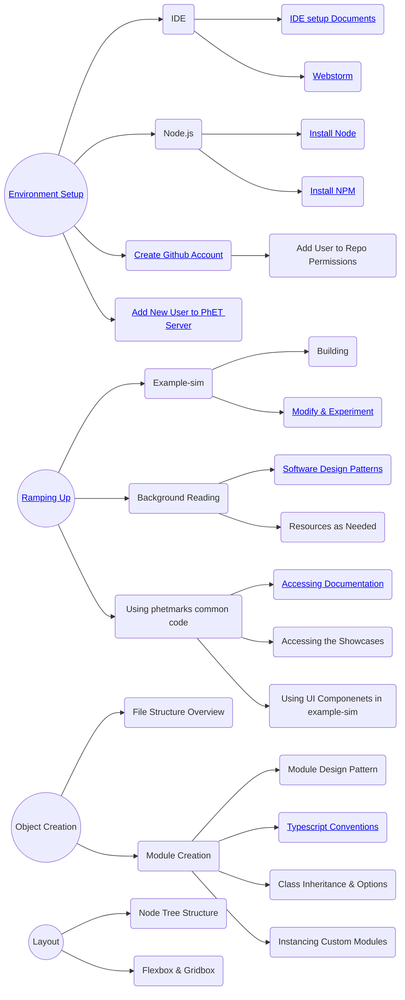

# Onboarding New Software Developers

This document is intended as a starting point for new developers that are joining the PhET team and plan to contribute
to the development of simulations. The document discusses the process through which a new developer can acquire the
knowledge and skills needed to create and maintain PhET simulations.

Note that there are other software development roles at PhET beyond simulation development, such as writing code for the
website, the iOS and Android apps, the desktop app, and the translation utility. These roles will not be covered in this
document.

## Table of Contents

- [Intro](#intro)
- [Administrative Setup](#admin-setup)
- [Dev Environment Setup](#env-setup)
- [Introductory Development](#intro-dev)
- [Advanced Development](#advanced-dev)
- [Sample Roadmap](#roadmap)
- [Project Management](#project-management)
- [Reference Documents](#reference-docs)

<a id="intro">

## 👋 Intro

Welcome! We know jumping into to simulation development can be a bit overwhelming at first. PhET has been around since
2001, and has written a lot of code and created some pretty involved processes during that time. It will take a while
for a new developer to learn what they need to know to develop and maintain simulations, and the team understands
onboarding takes some dedicated time.

Each new developer will have had a unique set of experiences and education when starting at PhET, so it is not
possible to come up with a "one-size-fits-all" plan for what to read and work through to ramp up. Each new developer
will be assigned a mentor who is an experienced developer of PhET simulations, and one of the first steps of the process
should be to come up with a customized plan or "road map" for ramping up. This plan should be regularly reviewed and
updated during the process.

<a id='admin-setup'>

## 📝 Administrative Setup

In your first few days there are many configuration and setup steps that need to be completed to become a CU
and PhET employee. Check-in with the PhET Business Manager for a complete list of HR needs. Beyond those HR nees, the
following list specifies essential items for a PhET Developer:

- Get a CU Email account and identikey.
- Set up a GitHub Account with access to the phetsims organization (you should receive an invite to join).
- Ask the Business Manager to add you to the SIMS_DEV and BROWSER_SIDE_COMMON_CODE development teams on GitHub. This
  access
  will allow you to push code to sim repos and common code repos.
- Set up a Slack account and join the phetsims workspace (you should receive an invite to join). From here, join the
  #general, #dev-public, #developer, and #continuous-testing channels.
  - Be sure to set notifications in #continuous-testing to "All messages".
  - Check with your mentor about any other relevant channels to join.
  - If you are not familiar with Slack, check out some [tutorials](https://slack.com/help/categories/360000049063) on
    how to use it.

 <a id='env-setup'>

## 👩‍💻 Development Environment Setup

Itching to dig into the code? The following are the steps needed to start sim development:

- Follow the steps in
  the [Getting Started](https://github.com/phetsims/phet-info/blob/master/doc/phet-development-overview.md#getting-started)
  section of the PhET Development Overview doc.
  - Install some command line programs
  - Get a copy of phet repos
  - Try running a sim locally on your machine
- Set up an IDE so you can start writing code.
  - Most developers use Webstorm or IntelliJ IDEA, recommended instructions can be found in
    the [IDE setup document](https://github.com/phetsims/phet-info/blob/master/ide/idea/setup.md).
- Before you start committing and pushing code to PhET repos, you should set up pre-commit hooks.
  - Pre-Commit Hooks prevent developers from committing code that has various types of errors, most notably ESLint and
    TypeScript errors.
  - Follow step 13.
    of [Utilities and Instrumentation for Development and Testing](https://github.com/phetsims/phet-info/blob/master/doc/phet-development-overview.md#utilities-and-instrumentation-for-development-and-testing)
    in the PhET Development Overview doc for instructions on setting them up.

<a id='intro-dev'>

## 🐣 Introductory Development

The PhET team has developed systems that make working in the codebase fun and productive. Although we encourage you to
find your own development style, the following recommendations have been refined after years of development team
conversations and experiences.

### Pull & Push Routines

You may be surprised to find that PhET developers work off of, commit, and push to the master branch. The reasons for
this workflow are beyond the scope of this document. However, working off of master does require specific routines in
pull, push, and commit behaviors.

- Pull code from all repos, every morning.
  - Recommended to use the pull-all.sh script in perennial
  - Continue to pull frequently throughout the day
- Do not commit broken code.
  - Sims should load, test, and lint without errors
  - Pre-Commit Hooks help catch errors, read more below.
- Push code frequently (some devs push after every commit).
  - Recommended to use the push-all.sh script in perennial

### Pre-Commit Hooks

During environment setup, you installed git hooks to prevent committing lint, tsc, and unit-test errors. However, it can
be frustrating and error-prone to discover these errors for the first time when trying to commit.

- Run the script `chipper/js/scripts/precommit-hook-multi.js` intermittently during development to avoid surprises when
  you commit.
  - Results are cached for efficiency and will only run on repos with working copy changes.
- Set `chipper/js/scripts/precommit-hook-multi.js` as
  an [External Tool](https://www.jetbrains.com/help/idea/settings-tools-external-tools.html) in WebStorm/ IntelliJ.
  - You can bind external tools to a key command for ease-of-use.

### Debugging

- Console.log
  - A favorite amongst JavaScript developers, console.log allows you to log values to the console, which can help developers
    take a peek into what is happening in the code at runtime.
- Debugger
  - You can insert the `debugger` keyword in code to set a breakpoint that allows you to explore code in a paused
    state in a console.
- [Chrome Dev Tools](https://developer.chrome.com/docs/devtools/)
  - Chrome Dev Tools is built into the Chrome browser and provides a set of powerful web development tools for
    debugging and examining code.
  - Most developers on the team use Chrome for development and testing for performance and bugs on other browsers. If you
    have a different preference do not feel obligated to use Chrome.
  - This is a [handy tutorial](https://developer.chrome.com/docs/devtools/javascript/) for debugging JavaScript in
    Chrome Dev Tools.
- Helper Tool
  - The Helper tool will display information about PhET components, helping developers navigate and implement the internal
    code.
  - How to use:
    - Load a sim or common code repo
    - Press `Ctrl+Shift+H` (The helper tool box will appear)
    - Click on the component you want to know more about

### Phetmarks

Developers use phetmarks to run simulations and access other content. You can load it in the browser via your localhost
server at `{{path-to-phet-repos}}/phetmarks`.

Phetmarks contains different ways to run sims, demos for some non-sim repos to show what components they contain, and
links to documentation.

### Common Code

The term "common code" is mentioned several times in this document and tends to come up a lot in discussions amongst the
developers. In general, common code refers to a set of libraries that the development team has created that is reused
between sims and is intended to make the development process faster & easier, and also to make the behavior and
appearance of the sims more consistent. Each common code library is in its own repo and is generally targeted towards a
fairly specific function, such as graphic rendering or sound generation. One of the most challenging tasks for new
developers is to become familiar with the common code repos and how to apply them to the task of developing a
simulation. As of this writing, there are about ten of these repos that will almost certainly be used in any sim that a
developer creates, and there are additional libraries that may be used depending on the particular requirements of a
sim. A list of the common- code repos can be found at 
https://github.com/phetsims/perennial/blob/master/data/active-common-sim-repos. Talk with your mentor about which ones
to start ramping up on first.

Perhaps the most fundamental of the common code libs is "scenery", which is the graphics library that is used to define
and render pretty much everything that appears on the screen in a PhET sim. This one may be a good place to start,
since you'll definitely need to become pretty familiar with it to create a sim.

### Navigating Repos

Most of your work will be done in the `js` directory of a repo. If you are curious about the other files check out
the [Repository Structure](https://github.com/phetsims/phet-info/blob/master/checklists/code-review-checklist.md#repository-structure)
in the Code Review Checklist for an overview or ask your mentor for an explanation.

### Tutorials and Exercises

We prepared some exercises in order for you to get the hang of sim development. Try to complete, with the help of your
mentor, the steps described
in [this Dev Exercises document](https://github.com/phetsims/phet-info/blob/master/doc/phet-dev-excercises.md). This
way, you will catch glimpses of the tasks you'll be performing when developing a real PhET sim.

 <a id='advanced-development'>

## 🧗 Advanced Development

### Query Parameters

Sims can be run with various query parameters. Query parameters are by default "for internal use only" and should not be
shared outside of PhET. Public-facing query parameters must be explicitly designated by including `public: true`
in their schema.
Chipper's [initialize-globals.js](https://github.com/phetsims/chipper/blob/master/js/initialize-globals.js) contains
general global query parameters (preloaded).

Two examples of commonly used query params are:

- `fuzz`, used for testing a sim with random inputs
- `dev`, used for showing the dev bounds of a sim

### Additional IDE Features

Aside from setting up your development environment, there are additional IDE features devs use that may be useful to
start
adding to your workflow. Using patches, "show history", and live templates are a few examples. Check out
the [suggestions](https://github.com/phetsims/phet-info/blob/master/ide/idea/setup.md#suggestions) section of the IDE
setup document and ask
your mentor for any further explanation or additional tips.

### Automated Testing

PhET has a "Continuous Test" server that regularly pulls the latest code for all repositories, builds them, and
executes "[fuzz testing](https://en.wikipedia.org/wiki/Fuzzing)", and reports whether each of these sub-tests succeeded.
The
latest report can be found at
https://bayes.colorado.edu/continuous-testing/aqua/html/continuous-report.html.

The repository that implements the test server is called [aqua](https://github.com/phetsims/aqua).
You can run Aqua locally, which is useful when trying to verify common code changes.

PhET has a Slack channel called "continuous-testing" which is used by the server to notify developers when some major
status change occurs for the continuous testing process. The underlying process that powers these notifications is
called
continuous testing quick (CTQ), and it is the same service as the test boxes at the top of continuous-report. An example
error would be a lint error ends up in the code base, the server will send a message to this Slack channel. Sometimes,
errors triggered here are false positives, when only half of a changeset is picked up (mid-pull on a developer
machine).
In this case, we note the error on slack with a bird emoji (dodo/turkey/etc) to signify that CTQ should pass on the next
round.

### QUnit

Unit testing at PhET is done through [QUnit](https://qunitjs.com/). Although most sims do not have unit testing built
in, developers are encouraged to use unit testing as feels necessary for their development workflow. Most unit tests
exist in common-code repos and these tests are run as part of pre-commit hooks and continuous testing.

To run QUnit tests, navigate to the repo in question in phetmarks and click on Unit Tests (Unbuilt). Running the tests
in
the browser provides better error reporting, and debugging tools.

### TypeScript

#### History

PhET made a decision in early 2022 to migrate from JavaScript to TypeScript as the primary development language for our
simulations and build tools. This decision was motivated by a desire to have stronger type checking so that our code
base would be easier to navigate and maintain.

Much of the common code was migrated to TypeScript when this decision was made, but we did not proactively migrate the
simulations due to the cost of doing so. Many of these remain in JavaScript, and are likely to stay that way for a long
while if not indefinitely. New developers should be prepared to encounter a mix of TypeScript and JavaScript in the
code base, and may even be asked to fix or extend simulations that are written in JavaScript.

Also, the standards for TypeScript evolved quite a bit while the migration was in progress. It is therefore possible
that you encounter code that is written in TypeScript, but doesn't fully adhere to the current standards.
For this reason, always double check that any code that is being leveraged for a new sim meets the current standards.
Also, be prepared to fix up code that *doesn't* meet those standards. For a bit more information on the history of this
change, and on some specific things that changed during PhET's TypeScript evolution, please see
https://github.com/phetsims/chipper/issues/1281.

#### TSC

When you begin working in TypeScript files, you might hear a lot about tsc (TypeScript Compiler):

- tsc runs a type checker that will output type errors in our code. This type checking is already included in pre-commit
  hooks, but many developers enjoy having a tool where they can check for type errors outside of pre-commit hooks.
- The recommended method for running tsc is through the
  script [absolute-tsc.js](https://github.com/phetsims/chipper/blob/master/js/scripts/absolute-tsc.js). Documentation
  for how to run absolute-tsc from the command line, or as an external tool in Webstorm can be found at the top of the
  file.
- The [TypeScript Handbook](https://www.typescriptlang.org/docs/handbook/intro.html) is a great resource for diving into
  TypeScript. You can also find PhET specific TypeScript Conventions in the [Reference Documents](#reference-docs)
  section.

### Memory and Performance Profiling

When a sim is further along in development, it needs to be memory and performance tested before publication. Most
developers use Chrome
for both of these processes.

Read about how to conduct a memory
test [here](https://github.com/phetsims/QA/blob/master/documentation/qa-book.md#47-memory-leak-testing).
If there is a leak, you will need to do some memory profiling to find out where your sim is not properly managing
its memory usage. This in-depth process should be taught by your mentor when you begin on your first memory
investigation.

Performance profiling can also be a complex process. To start, you can check how well your sim is performing on various
devices by adding the query parameter `profiler` (another common [query parameter](#query-parameters)). It allows you to
see the live frame rate while you interact with various parts of the sim. If you find parts that aren't performing well,
ask your mentor how to record your interaction of the poor performance and investigate with Chrome's flame chart. Google
also provides some [documentation](https://developer.chrome.com/docs/devtools/evaluate-performance/reference/)
for how to do this profiling.

### Publishing a Sim

Once you're working on a sim, you will eventually want to publish a "dev version", which is short for "development
version", to show your latest progress.  This is distinct from other types of versions that are published, such as
release candidates.  See
[Adding new users to PhET's servers](https://github.com/phetsims/website#adding-new-users-to-phets-servers-so-a-user-can-upload-a-dev-version-or-participate-in-web-development)
, and ask a senior dev to help add your identikey to PhET's servers.

<a id='roadmap'>

## 🚗 Sample Roadmap

You've made it so far already! After all this reading you may be wondering where to go next. The flowchart below
provides just one example of how you may choose to structure your learning and growth here at PhET. We recommend
checking in with your mentor to customize your roadmap according to your
needs and experiences.

<a id='project-management'>  

## 👷‍♀ Project Management

PhET's approach and systems for project management are constantly evolving, especially as PhET continues to grow.
Currently we have a very flat management structure, and the development team works directly with the director of PhET to
set and track goals. All developers should feel free to suggest improvements to the project management process. Also,
please update this section of the onboarding document if you find that anything you read here is no longer accurate or
pertinent.

### Quarterly Goals

Each quarter we have meetings to discuss and set the goals for the upcoming quarter and review the progress of goals
from the previous quarter. The goals are driven largely by the grants that fund the work that we do and by the needs of
the simulation users. A [project board](https://github.com/orgs/phetsims/projects/41/views/33) is used to track and
maintain this information.

### Weekly Meetings

The development group meets weekly with the director of PhET to discuss items that are added to the agenda, and to work
through open issues that are on the project board.

The agenda and history for this meeting can be found in
this [google doc](https://docs.google.com/document/d/1bAPEP1iUxQRuCSLHkrwjAH-948kB-sBN3hCC54g-8dc/edit) (We update this
document every year, so if this link is out of date, please fix it!). Any developer can add an agenda item at any time
prior to the start of the meeting.

Developers are also encouraged to add GitHub issues to the [project board](https://github.com/orgs/phetsims/projects/35)
that they feel need to be discussed by the group. Our goal is to move through issue discussions quickly, and assign each
issue to a subgroup of developers who can finish the necessary work.

### GitHub Issues

As a developer, much of your moment-to-moment activity will be driven by the GitHub issues to which you are assigned. We
use GitHub issues to track action items, and to keep a record of what was done, when, by whom, and the motivation /
discussion surrounding the task.

GitHub issues can be assigned priority levels, which can help in organizing your day-to-day work. There are a number of
other labels for issues that are PhET-specific, and it will take some time to familiarize yourself with them all. You
can take a quick look at the available issue
labels [here](https://github.com/phetsims/phet-info/blob/master/github-labels/github-labels) (the hex
values represent the color of the label when it appears on an issue).

One of the tricky things about using GitHub issues to manage work is how widely variable the scope of an issue can be.
People create issues that can be addressed in half an hour, as well as issues that would take several months of
focused effort to complete. One of the labels that we try to use to help manage this situation is the `type:epic` label.
An epic is an issue that is more of a project than a clear and finite task. This type of issue is likely to involve
multiple people, and will have "sub-issues" created for the individual tasks that will go into completing the "epic".

<a id='reference-docs'>

## 📖 Reference Documents

Below is a list of documents that are helpful for reference. It's important to know that these exist. New developers
should skim through them, then reference them as needed while developing code. This list doesn't include *all*
documents that might be useful, it's just a good list to start with. If a new developer is looking for a document on
a particular topic that is not listed below, https://github.com/phetsims/phet-info is a good place to start. After
that, it's probably best to ask around.

| Doc                                                                                                                 | Contents                                                                          |
|---------------------------------------------------------------------------------------------------------------------|-----------------------------------------------------------------------------------|
| [Deployment Info for chipper 2.0](../deployment-info/chipper-2.0.md)                                                | A guide to deploying simulations for testing and ultimately to the website        |
| [New Dev Onboarding](./new-dev-onboarding.md)                                                                       | A guide and resource for new sim developers (this document)                       |
| [PhET Code Review Checklist](../checklists/code-review-checklist.md)                                                | A checklist for evaluating simulation code                                        |
| [PhET Development Overview](./phet-development-overview.md)                                                         | A checklist for evaluating simulation code                                        |
| [PhET Quarterly Goal Planning](https://github.com/orgs/phetsims/projects/41/views/1)                                | Goals for current quarter (not really a doc, but important)                       |
| [PhET Software Design Patterns](./phet-software-design-patterns.md)                                                 | Provides information on how PhET uses various software design patterns            |
| [Private Features for PhET Team Members](https://github.com/phetsims/special-ops/blob/master/doc/phetTeamMember.md) | Information on hidden features. This comes up most often during game development. |
| [Responsible Devs](../sim-info/responsible_dev.md)                                                                  | Associates repos with the developer who is responsible for maintenance            |
| [TypeScript Conventions](./typescript-conventions.md)                                                               | PhET's TypeScript conventions                                                     |
